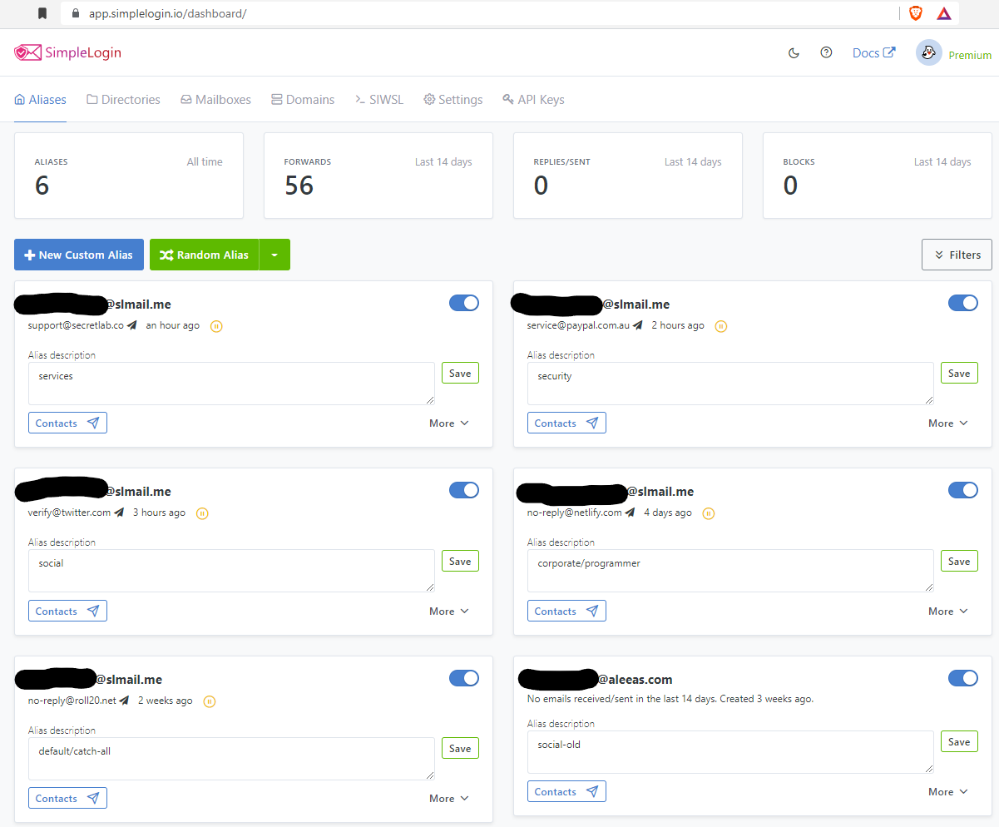

Emails are used for everything you do online - from passing information around at work to signing up for online services.
Eventually, you may end up in a situation where your mailbox is flooded with newsletters and promotions, and sometimes even spam.
Email aliases can make it easier to keep your mailbox in order, as well as to keep spam in check.

##### Introducing email aliases

Email aliases let you create multiple different email addresses ("aliases") that forward all emails to your real email address.
This lets you use different email addresses in different places.
For example, you might use one email address for anything shopping related, and another for anything social media related.

  <em>But why not just make multiple email accounts?</em>

You could! Having email accounts is also a way to separate and organize emails, and this might be easier than having to set up aliases.
**The main advantage of email aliases is the ability to easily create multiple email addresses that point to an existing email account.**
These addresses can also be easily discarded.
On the other hand, signing up for a new email account would require you to enter your details such as name and phone number every single time.

  <em>Ok! So how do I get started?</em>

**A word of caution:**

> Be careful not to accidentally delete an email alias that is currently in use, it will lock you out of any online services linked to that alias.
> Additionally, using email aliases means that all of your emails are forwarded through, and thus visible to the aliasing service you use.
> Please do your own research to make sure you understand what you are doing, as I am not responsible for any damages that may occur.

First up, some email providers have built-in email aliasing.

- Outlook: <a target="_blank" href="https://support.microsoft.com/en-us/office/add-or-remove-an-email-alias-in-outlook-com-459b1989-356d-40fa-a689-8f285b13f1f2">Add or remove an email alias in Outlook.com</a>
- ProtonMail: <a target="_blank" href="https://protonmail.com/blog/what-is-email-alias/#creating-email-aliases">Creating email aliases</a>

You can use Google to see if your email provider has aliasing support.

##### Creating email aliases with SimpleLogin

  <a target="_blank" href="https://simplelogin.io/">
    SimpleLogin
  </a>{' '}
  is a free email aliasing service you can use with any email account. You can
  get started by signing up with your email.

  <em>SimpleLogin dashboard</em>

After signing up, you can start making aliases by clicking on the "New Custom Alias" button.
Enter a prefix for the alias name, and you can start using your newly generated alias to send/receive emails.

##### Tips using SimpleLogin

###### Setting a display name

By default, your display name will include the randomly generated part of your email.
For example, if I generated <em>"simon.somerandomletters@slmail.me"</em>, then the emails I send would appear as <em>"From: Simon Somerandomletters <simon.somerandomletters@slmail.me>"</em>.
Yikes! To fix this, click on the "More" button and set your "Display name" - in my case "Simon Lin".

  <em>Setting a display name</em>

###### Sending an email from an alias

To send an email from an alias, you first have to create a "reverse alias" for the person you want to send the email to.
Just like how people send emails to your mailbox through your "alias", you send emails to others through a specially generated "reverse alias".
To create a reverse alias, click on the "Contacts" button for the alias you want to use, and enter the email address of the person you want to send to.
After it's made, any emails you send to the reverse alias will be sent to them through your alias.

  <em>Create a reverse alias</em>

You only need to create a reverse alias once for each email address, and it will be saved as a contact.
The next time you need it, you only have to copy the reverse alias from the contacts list of the alias you're using.

##### In summary

> Email aliases are email addresses that forward emails to a single email address.
> This allows you to keep your real email address hidden, and easily create different email addresses to use with different services.
>
> Aliases are more convenient over creating email accounts if you frequently need to create and discard email addresses, or need (a sizeable number of) different email addresses.
