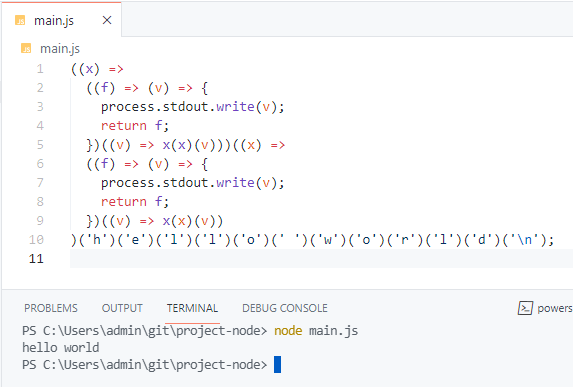

import 'katex/dist/katex.min.css'

<em>
  Note: requires an understanding of lambda/closure functions, higher-order
  functions and currying.
</em>

The Y combinator, also known as the fixed point combinator, is a function that finds the fixed point of other functions.

# What are fixed points?

A fixed point of a function is some input that causes the function's output to be the same as the input itself.

For example, for the function <tex>f(x) = x</tex>, all inputs are fixed points, since the function simply returns what it was given.
Mathematicians have a fancy word for a function that simply returns what it was passed - the "identity" function.

On the other hand, for the function <tex>f(x) = x^2</tex>, the function only has 2 fixed points <tex>x=0</tex> and <tex>x=1</tex>.

For functions that work on numbers (i.e. <tex>f: R\rightarrow R</tex>), you can find a fixed point by solving for <tex>f(x) = x</tex>.
For example, in the case of <tex>f(x) = x^2</tex>:

```latex
\begin{align*}
f(x) &= x^2 = x \\
x^2 &= x \\
x^2 - x &= 0 \\
x(x - 1) &= 0 \\
x &= 0, 1
\end{align*}
```

The idea behind the Y combinator is to find the fixed points of <em>higher order functions</em>.
Those are functions that take and return functions.
One of the interesting things that the Y combinator lets you do is to enable recursion in an environment that doesn't natively support it.

# The factorial function

The factorial function <tex>f(x) = x!</tex> may be implemented recursively in javascript like this:

```javascript
function factorial(v) {
  if (v == 0) {
    return 1
  }

  return v * factorial(v - 1)
}

factorial(7) // = 5040
```

Now, the challenge is to construct a recursive factorial function without self-reference,
meaning that the factorial function can't contain a call to itself like the one above.

This is done by making a factorial function that takes 2 arguments:

- The number to compute the factorial of
- A copy of itself

```javascript
function factorial(v, fn) {
  if (v == 0) {
    return 1
  }

  return v * fn(v - 1, fn)
}

factorial(7, factorial) // = 5040
```

> Technically, in the above code `factorial` was passed a reference to itself.
> For a more correct example, you would first create a copy of `factorial` and pass this copy as the second argument.
> Since the result is the same, I've omitted this for simplicity.

When calling this factorial function, you pass as an additional argument a copy of itself.

How does this work?

Let's think about what the `factorial` function does:

- If <tex>v</tex> is <tex>0</tex>, return <tex>1</tex>
  - Otherwise, return <tex>v</tex> multiplied by the result of calling `fn` with <tex>v - 1</tex> and a copy of itself

And what does the `fn` function inside of the `factorial` do?

- It does the same thing as the `factorial` function

If `factorial` returns <tex>v</tex> multiplied by the result of calling `fn` with <tex>v - 1</tex>,
(until when <tex>v = 0</tex> where it returns <tex>1</tex>),
and `fn` is supposed to do the exact same thing as `factorial`,
then for example calling `factorial` with <tex>v = 7</tex> would give you:

```latex
\begin{align*}
7 * (6 * (5 * (4 * (3 * (2 * (1)))))) &= 7 * 6 * 5 * 4 * 3 * 2 * 1 \\
&= 7! \\
&= 5040
\end{align*}
```

The result is a recursive factorial function that doesn't call itself, but rather a copy of itself that behaves exactly the same as itself.

What we saw was that you create a recursive function by calling it with a copy of itself.
It's actually possible to automate this so that we don't have to explicitly call `factorial` with itself every single time.

# Automating the act of calling a function with itself

First, we curry the `factorial` function, and rename it to `create_factorial`:

```javascript
const create_factorial = (fn) => (v) => {
  if (v == 0) {
    return 1
  }

  return v * fn(fn)(v - 1)
}

const factorial = create_factorial(create_factorial)

factorial(7) // = 5040
```

Here, `create_factorial` <span style={{color: 'limegreen'}}>"is a function that binds what you pass it to the value `fn`, and then returns another function that contains calls to `fn`."</span>

What we pass `create_factorial` is a copy of itself, since we need the function that it returns to have access to a copy of itself. So `fn` becomes a copy of `create_factorial`.

Inside of this other function, we see it calling `fn(fn)(v - 1)`. Why the call to `fn(fn)` instead of directly calling `fn` by itself?

Since `fn` is a copy of `create_factorial` it also does the same thing as `create_factorial`.
And so (repeat), `fn` <span style={{color: 'limegreen'}}>"is a function that binds what you pass it to the value <strike><code>fn</code></strike> <code>fn2</code></span>
(oops - let's call this one <code>fn2</code>)<span style={{color: 'limegreen'}}>, and then returns another function that contains calls to `fn2`."</span>

Since `fn` is the same as `create_factorial`, then the way we use it also has to be the same - by first passing it into itself!

# Converting `create_factorial` to work with fixed points

The next step is trickier, and also quite long to explain.
We want to make it so that the can in fact "directly call `fn`" inside of the function that `create_factorial` returns like this:

```javascript
return v * fn(v - 1)
```

instead of:

```javascript
return v * fn(fn)(v - 1)
```

Let's reason our way through this. We want to call `create_factorial` with "something" - let's name this `S`.
`S` needs to be a function that satisfies a certain property:

- Calling `S` with some argument needs to be equivalent to calling the result of calling `create_factorial` with `S` with some argument. i.e.

```latex
S(v) \xleftrightarrow{} create\_factorial(S)(v)
```

From here, you can directly construct such an `S` from the above requirement:

```javascript
const S = (v) => create_factorial(S)(v)
```

We'll allow direct self-reference for now to make it easier to work with.

Here is where fixed points come in. `S` in the above is actually a fixed point of the `create_factorial` function (remove <tex>(v)</tex> from both sides):

```latex
S \xleftrightarrow{} create\_factorial(S)
```

This is why calling `S` is equivalent to calling the result of calling `create_factorial` with `S`.

While the above is perfectly valid (it works), we're going to change it up a little.
The reason being that the Y combinator (although equivalent to the above) is worded slightly differently from what we have here in a way that's not too obvious.
This time, we'll use a slightly different angle:

- Calling `create_factorial` with "something" gives us a function. We'll once again name this "something" `S`
- `S` needs to call create_factorial with another "something" - we'll name this other "something" `T`
- `T` needs to be a function that satisfies a certain property:
  - Calling `T` with some argument needs to be equivalent to calling `S` with some argument
  - In other words, `T` can simply be a function that calls `S`.

You may notice how this is a continuation from before that goes 1 more step into the recursion.

Once again, we construct `S`, this time with `T`:

```javascript
const T = (v) => S(v)
const S = create_factorial(T)

// i.e.
const S = create_factorial((v) => S(v))
```

You may wonder why `T` doesn't directly call `S`, i.e. `const T = S(v)`, or `const S = create_factorial(S(v))`.
The is because when javascript tries to evaluate what the value of `S` is, it will call `create_factorial` with `S(v)`,
which calls `S` with `v`, which then again calls `create_factorial` with `S(v)` and so on.. leading to an infinite loop.
Evaluating an expression immediately like this is known as "[eager evaluation](https://www.google.com/search?q=eager+vs+lazy+evaluation)".

Currently, our definition of `S` makes use of self-reference, and our next step is to get rid of that.
We've already seen how to do this with the create_factorial function, and this is no different.

First, we'll curry `S`, and replace all calls to `S` from inside itself with `fn(fn)`:

```javascript
const S = (fn) => {
  return create_factorial((v) => fn(fn)(v))
}
```

To finish, we call `S` with itself, and check the result:

```javascript
const create_factorial = (fn) => (v) => {
  if (v == 0) {
    return 1
  }

  return v * fn(v - 1)
}

const S = (fn) => {
  return create_factorial((v) => fn(fn)(v))
}

const F = S(S)

F(7) // = 5040
```

It works! We've successfully replaced the call to `fn(fn)` with a call to `fn`.

This is a lot of effort to change a minor thing - we could have stuck with using `fn(fn)` and saved ourselves the trouble.
However, what this lets us do is to directly derive to Y combinator, which is now only a few formatting steps away.

First, we convert variable names (`fn` to `x` and `S` to `Z`) and convert to an arrow function:

```javascript
const Z = (x) => create_factorial((v) => x(x)(v))
```

Converting to an [IIFE](https://www.google.com/search?q=immediately+invoked+function+expression):

```javascript
const Z = ((x) => create_factorial((v) => x(x)(v)))((x) => create_factorial((v) => x(x)(v)))
// the above is equivalent to:
let Z = ((x) => create_factorial((v) => x(x)(v)))
Z = Z(Z)
```

The above is `((x) => create_factorial((v) => x(x)(v)))` repeated twice.
The first one for the function definition, the second one for the argument we call it with.
In this case we're calling it with a copy of itself.

Finally, instead of only working on the `create_factorial` function, we curry this and replace `create_factorial` with the argument `f` so that we can pass it any function:

```javascript
const Z = (f) => ((x) => f((v) => x(x)(v)))((x) => f((v) => x(x)(v)))
```

Double checking:

```javascript
const create_factorial = (fn) => (v) => {
  if (v == 0) {
    return 1
  }

  return v * fn(v - 1)
}

const Z = (f) => ((x) => f((v) => x(x)(v)))((x) => f((v) => x(x)(v)))

const factorial = Z(create_factorial)

factorial(7) // = 5040
```

So now, for any function in the same format as our previous factorial function, `Z(f)` enables recursion for it.
Specifically, `Z(f)` finds the <em>fixed point</em> of the function.

# The Z combinator

The `Z` we have above is actually named the Z combinator, which is a form of the Y combinator adapted to work with eagerly evaluated languages.
To see this, it helps to know some python - we'll first convert our javascript code to python.

```javascript
const Z = (f) => ((x) => f((v) => x(x)(v)))((x) => f((v) => x(x)(v)))
```

In python:

```python
Z = lambda f: (lambda x: f(lambda v: x(x)(v)))(lambda x: f(lambda v: x(x)(v)))
```

Finally, we'll convert the python code to a lambda calculus expression:

```latex
Z = \lambda f.(\lambda x.f(\lambda v.xxv))(\lambda x.f(\lambda v.xxv))
```

[You'll find the exact same statement on the wikipedia page](https://en.wikipedia.org/wiki/Fixed-point_combinator#Strict_fixed-point_combinator).

# The Y combinator

Finally, the Y combinator is a more "relaxed" Z combinator that doesn't explicitly define the extra <tex>\lambda v</tex> in the body:

```latex
Y = \lambda f.(\lambda x.f(xx))(\lambda x.f(xx))
```

# Conclusion

Hopefully, my explanation of the Y combinator was clear to follow and understand.
The Y combinator doesn't have much (if any) practical application in today's world,
but trying to understand it is good practice for logical thinking.

The Y combinator is somewhat similar to in feel to topics such as the
[diagonal lemma](https://en.wikipedia.org/wiki/Diagonal_lemma),
[incompleteness theorem](https://en.wikipedia.org/wiki/G%C3%B6del%27s_incompleteness_theorems)
and [halting problem](https://en.wikipedia.org/wiki/Halting_problem).
Very similar methods are used in these areas to prove fundamental results in logic,
as all of these stem from the idea of <em>"self-reference"</em> - having the ability to refer to oneself.



<center>
  <em>Recursing on anonymous functions with the Z combinator</em>
</center>
